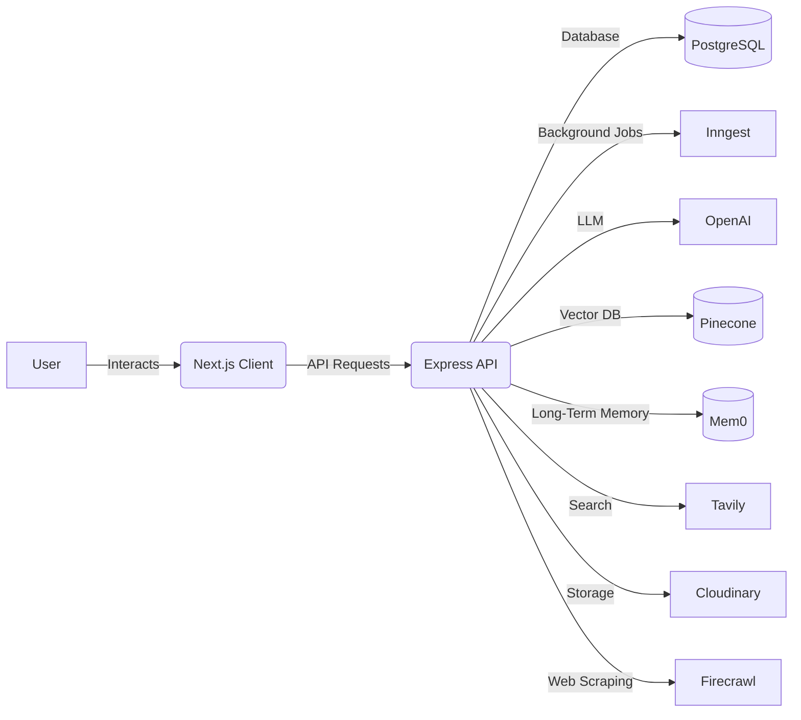
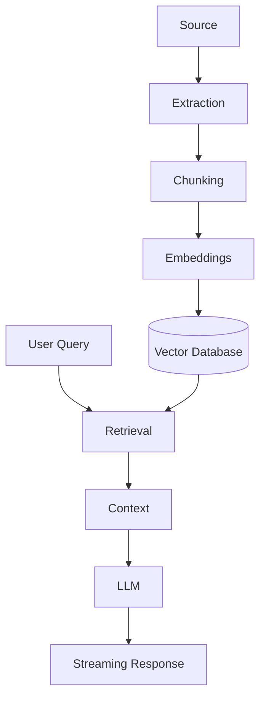
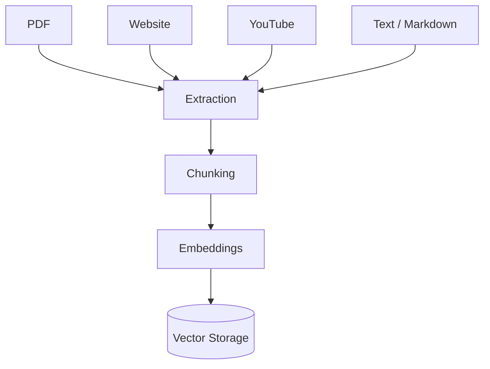
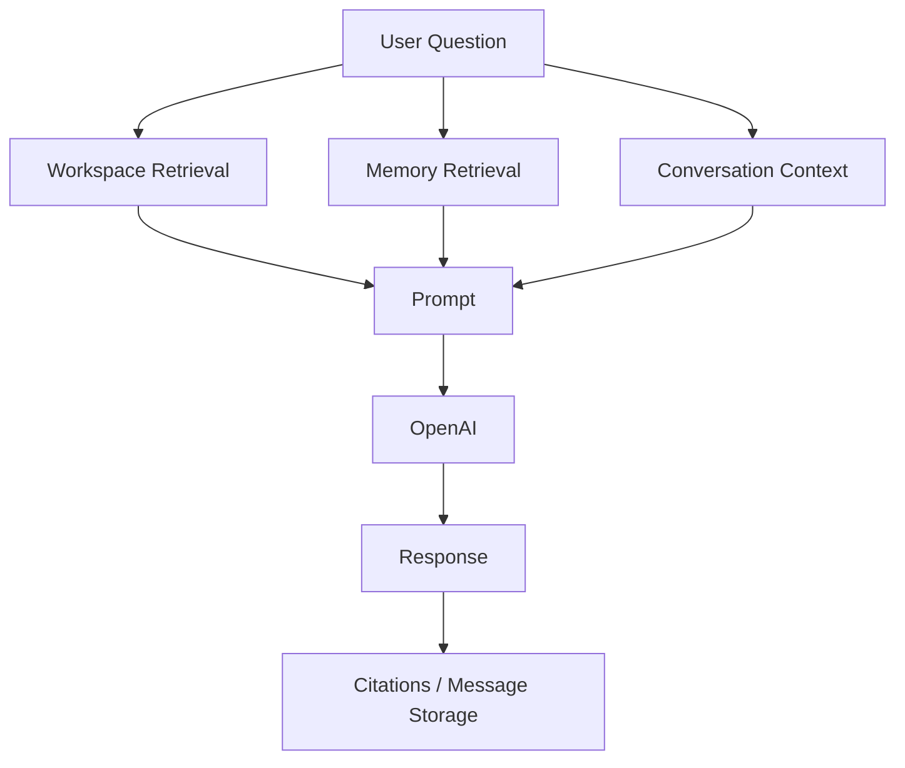
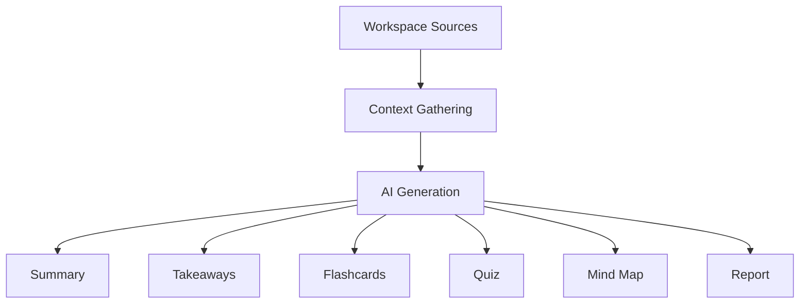
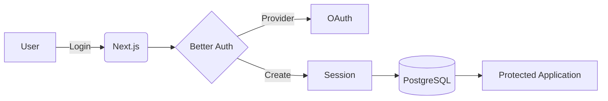
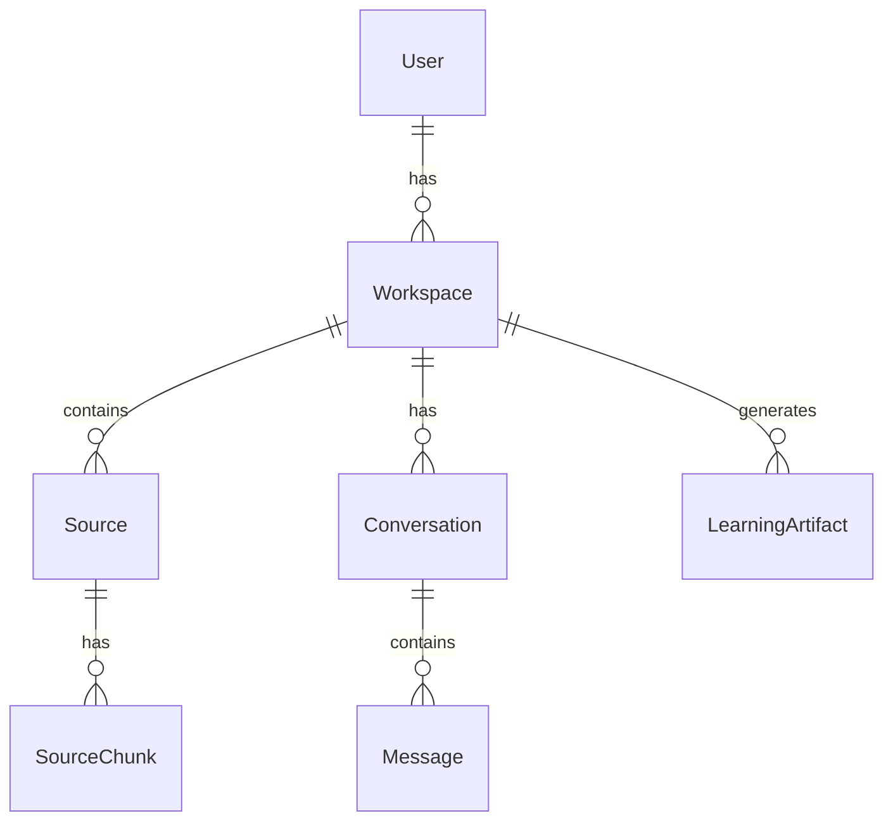
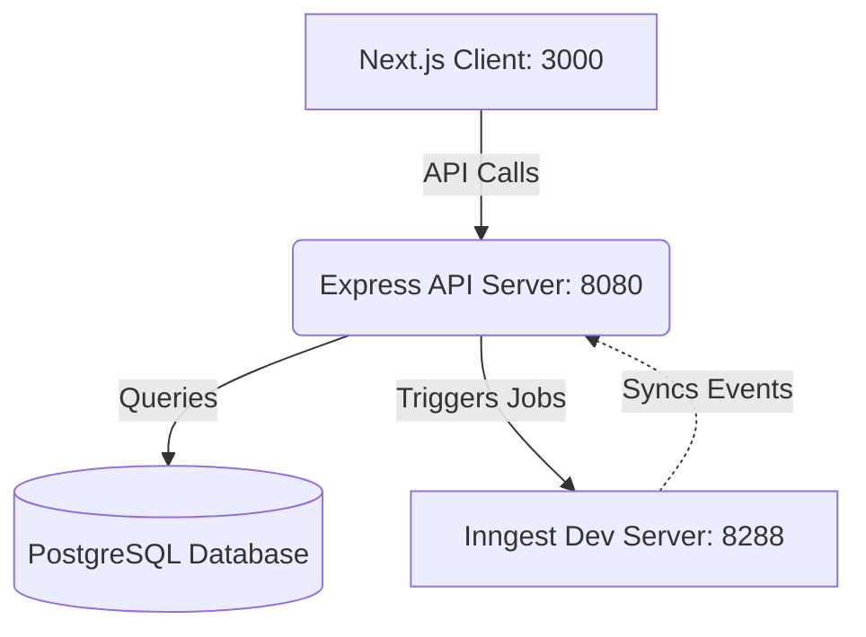

# ChaibookLM
> A comprehensive, AI-powered learning and knowledge management system built with RAG capabilities.

## Overview
ChaibookLM is an advanced, production-ready full-stack application designed to process, store, and chat with educational content. It leverages Retrieval-Augmented Generation (RAG) to allow users to interact with PDFs, websites, YouTube videos, and text notes. The system seamlessly extracts content, chunks it, generates embeddings, and utilizes large language models to answer questions, generate learning artifacts, and maintain long-term memory.

## Key Features
- **Multi-modal Document Processing**: Support for PDFs, websites (via Firecrawl), YouTube transcripts, Text, and Markdown.
- **RAG-powered Chat**: Highly accurate AI conversations grounded in user-provided workspace sources.
- **Learning Artifact Generation**: Automated generation of summaries, key takeaways, flashcards, quizzes, mind maps, and comprehensive reports.
- **Long-Term Memory**: Stateful AI interactions using Mem0 for context persistence.
- **Secure Authentication**: Robust OAuth integration via Better Auth.
- **Background Processing**: Reliable background task execution via Inngest for heavy document extraction and chunking.

## How ChaibookLM Works
Users create distinct workspaces and populate them with source materials. The system asynchronously processes these sources (extracting text, chunking, and embedding). Users can then chat with their workspace via a Next.js interface, with the Express API orchestrating vector similarity searches (Pinecone), gathering memory (Mem0), and streaming LLM responses (OpenAI).

## System Architecture



## RAG Architecture



## Document Processing Pipeline



## AI & LLM Architecture
- **Language Models**: OpenAI (e.g., `gpt-4o-mini`) is utilized for inference, text generation, and dynamic tool calling.
- **Embeddings**: Utilizes `text-embedding-3-small` (1536 dimensions) for dense vector generation.
- **Vector Search**: Pinecone handles cosine similarity search against source chunks.
- **Streaming**: Vercel AI SDK handles continuous response streaming from the server to the Next.js client.

## AI Chat Flow



## Learning Artifacts
Artifacts represent synthesized knowledge derived from user sources.



## Long-Term Memory
Powered by **Mem0**, the system tracks user preferences, factual observations, and conversational history across sessions, ensuring the assistant adapts to individual learning styles and recalls past interactions accurately.

## Authentication



## Technology Stack

| Category | Technology | Version / Provider |
| :--- | :--- | :--- |
| **Frontend** | Next.js, React | v16.2.12, v19.2.4 |
| **Styling** | Tailwind CSS, shadcn/ui | v4.x, v4.16.0 |
| **State Management** | Zustand, React Query | v5.0.14, v5.101.4 |
| **Backend API** | Express.js, Node.js | v5.1.0 |
| **Database ORM** | Prisma | v7.9.1 |
| **Primary Database** | PostgreSQL | Prisma Adapter (`pg`) |
| **Vector Database** | Pinecone | v8.1.0 |
| **Background Jobs** | Inngest | v4.13.0 |
| **Authentication** | Better Auth | v1.6.25 |
| **AI / LLM** | OpenAI, Vercel AI SDK | v7.1.0, v7.0.42 |
| **Memory** | Mem0 | v3.1.2 |
| **Scraping / Search** | Firecrawl, Tavily | v4.31.1, v0.7.6 |
| **Storage** | Cloudinary | v2.10.0 |

## Project Structure
```text
chaibook-llm/
├── client/
│   ├── app/                # Next.js App Router
│   ├── components/         # React Components (shadcn/ui)
│   ├── features/           # Feature-based module grouping
│   ├── lib/                # Client utilities
│   ├── public/             # Static assets
│   └── shared/             # Shared types/utils
├── server/
│   ├── migrations/         # Prisma DB Migrations
│   ├── prisma/
│   │   └── schema.prisma   # Database Models
│   └── src/                # Express application source
└── docker-compose.yml      # Local infrastructure
```

## Database Architecture



### Core Models

| Model | Description |
| :--- | :--- |
| **User** / **Session** | Better Auth tables for identity and session management. |
| **Workspace** | A container for related sources, conversations, and artifacts. |
| **Source** | A document (PDF, Website, YouTube, Text, Markdown). |
| **SourceChunk** | Embedded text segments mapped to a specific `Source`. |
| **Conversation** | A chat session within a workspace. |
| **Message** | Individual user/assistant messages with citation storage. |
| **LearningArtifact** | AI-generated knowledge assets (Summaries, Quizzes, etc). |

## API Architecture
- RESTful Express endpoints (`/api/v1/*`)
- Webhooks for Inngest event triggers (`/api/inngest`)
- Next.js acts primarily as a UI layer, making direct calls to the Express backend.

## Environment Variables

| Variable | Description |
| :--- | :--- |
| `PORT` | Express server port (default 8080) |
| `DATABASE_URL` | PostgreSQL connection string |
| `BETTER_AUTH_SECRET` | Secret key for auth token signing |
| `BETTER_AUTH_URL` | Base URL for auth callbacks (e.g., `http://localhost:3000`) |
| `CLIENT_URL` | Frontend URL for CORS |
| `GOOGLE_CLIENT_ID` / `SECRET` | OAuth credentials |
| `CLOUDINARY_*` | Cloudinary API keys and upload presets for PDF storage |
| `FIRECRAWL_API_KEY` | API key for website parsing |
| `INNGEST_DEV` | Set to `1` for local background task execution |
| `OPENAI_API_KEY` | API key for embeddings and text generation |
| `PINECONE_API_KEY` / `INDEX` | Vector database configuration |

## Local Development Setup
1. Clone the repository.
2. Ensure you have Node.js and Postgres installed (or use the provided `docker-compose.yml` for DB).
3. Install dependencies in both directories:
   ```bash
   cd client && npm install
   cd ../server && npm install
   ```
4. Configure `.env` in the `server` directory based on `.env.example`.
5. Run database migrations:
   ```bash
   cd server && npx prisma generate && npx prisma db push
   ```

## Running the Application



1. **Start the API Server**:
   ```bash
   cd server
   npm run dev
   ```
2. **Start the Inngest Dev Server** (for background jobs):
   ```bash
   npx inngest-cli@latest dev
   ```
3. **Start the Next.js Client**:
   ```bash
   cd client
   npm run dev
   ```

## Testing
- Ensure PostgreSQL is running and accessible.
- Verify Inngest dashboard (usually `http://localhost:8288`) shows background job registrations.

## Security
- Routes are protected via Better Auth session validation.
- Workspaces and Sources are strictly scoped to the `userId`.
- API Keys are stored purely in the server environment, never exposed to the client.

## Performance
- Document chunking and embedding are offloaded to Inngest to prevent blocking the main Node thread.
- Vector search latency is minimized through Pinecone's indexed cosine similarity.
- Streamed LLM responses enhance perceived performance on the client UI.

## Current Project Status
**Active Development / Beta.** Core functionalities including document uploading, chunking, Pinecone indexing, AI chat, and UI interactions are verified.

## Known Issues & Limitations
- Large PDFs may take longer to process and embed based on Inngest concurrency limits.
- YouTube transcript fetching may fail if closed captions are completely disabled on the target video.

## Future Improvements
- Expanded support for localized LLMs (e.g., Ollama).
- OCR support for scanned documents.
- Collaborative workspaces for multi-user sharing.

## Contributing
1. Fork the repository
2. Create a feature branch (`git checkout -b feature/amazing-feature`)
3. Commit your changes (`git commit -m 'Add amazing feature'`)
4. Push to the branch (`git push origin feature/amazing-feature`)
5. Open a Pull Request

## License
ISC License
